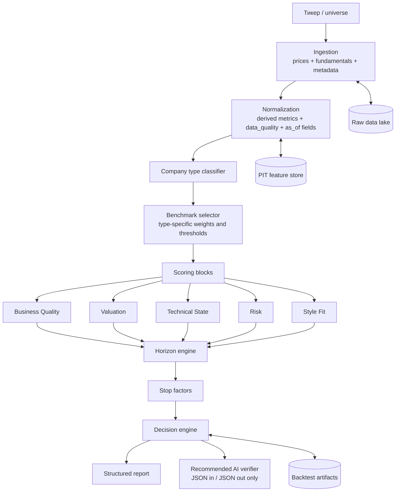

# Аудит и ревью алгоритма автоматизированного аналитика акций

## Executive summary

Я оцениваю только **схематически описанный алгоритм**; исходный код, исторические снапшоты данных, журналы прогонов, параметры калибровки, результаты бэктеста, трейд-логи и артефакты AI-слоя мне не были предоставлены. Поэтому это **дизайн-аудит по лучшим практикам**, а не верификация фактической доходности. В текущем виде у меня получился **сильный research-grade rule-based аналитик для single-stock triage**, но **не production-ready инвестиционный движок**. Главные плюсы — прозрачная модульная архитектура, понятный decomposition на блоки quality/valuation/technical/risk/style, явные стоп-факторы и раздельные горизонты short/medium/long. Главные минусы — отсутствие подтверждённого point-in-time режима, отсутствие documented calibration/backtest protocol, сильная зависимость от `yfinance info` как snapshot-источника, годовая частота фундаментала без 10-Q, отсутствие портфельной логики и неописанный AI-verifier слой. Для production это критично, потому что SEC действительно даёт официальный API по 10-K/10-Q/XBRL и обновляет данные в течение дня, а `yfinance` сам прямо оговаривает, что библиотека не аффилирована с Yahoo и предназначена для research/education/personal use. citeturn3view0turn3view1turn3view6

Мой итоговый вердикт такой: **архитектурно это хороший MVP аналитика**, но **как инвестиционный процесс он пока недоопределён**. Я не могу честно говорить о CAGR, Sharpe, Calmar, max drawdown, turnover, slippage robustness или production reliability, пока не заданы как минимум: point-in-time universe, as-of timestamps для всех фичей, rebalance protocol, transaction cost model, position sizing, stress scenarios, out-of-sample/walk-forward design и реплицируемые журналы результатов. Bailey и López de Prado отдельно показывают, что простой hold-out для инвестиционных backtests ненадёжен, а метрики вроде Sharpe надо корректировать на множественные пробы и non-normal returns через DSR/PBO-подобные подходы. citeturn3view2turn3view5

Ниже — моя экспертная дизайн-оценка по доступному описанию.

| Область | Моя оценка | Комментарий |
|---|---:|---|
| Архитектура пайплайна | 7/10 | Логика модулей прозрачна, декомпозиция удачная |
| Источники данных | 4/10 | SEC — сильный выбор, но `yfinance` и snapshot-поля создают серьёзный риск leakage/нестабильности |
| Инженерия фичей | 6/10 | Набор разумный, но много пропусков по PIT, sector-relative и one-off adjustments |
| Scoring и правила | 6/10 | Интерпретируемо, но ручные шкалы/веса не откалиброваны и не подтверждены OOS |
| Риск-менеджмент | 3/10 | Есть stop-факторы на уровне бумаги, почти нет портфельного риска |
| Валидация | 2/10 | Не указаны backtest protocol, OOS, walk-forward, DSR/PBO, leakage checks |
| Production readiness | 2/10 | Не указаны код, CI/CD, observability, immutable snapshots, dependency pinning |

Критические выводы, которые я бы зафиксировал сразу, такие:

- Я бы **не использовал текущую версию для реальных инвестиционных решений без промежуточного research-hardening**.
- Самый опасный скрытый риск — **lookahead/data leakage через snapshot-поля и незафиксированные даты доступности фундаментала**.
- Самый большой пробел в методологии — **модель оценивания есть, а стратегия и портфельная механика не определены**.
- Самый приоритетный апгрейд — **перевести все данные и расчёты в point-in-time и event-aware режим**, затем уже калибровать веса и только потом подключать AI-верификатор. citeturn4view0turn6view0turn3view4

## Предпосылки и входные данные

По доступной мне схеме я использую следующий набор входов: цены через `yfinance`, годовой фундаментал через SEC EDGAR XBRL, нормализацию фундаментальных рядов, rule-based классификацию компании, тип-специфичный benchmark, пять блоков scoring, три горизонта оценки и stop-факторы. Единственный доступный артефакт — markdown-документация алгоритма. Всё, что касается фактического исполнения, сейчас отсутствует или **не указано**.

| Артефакт | Статус | Что именно нужно для полноценного аудита |
|---|---|---|
| Схема алгоритма | есть | markdown/ADR/README уже есть |
| Исходный код | не указано | repo, commit hash, lockfile, config files |
| Исторические данные | не указано | raw snapshots, adjusted price history, PIT fundamentals |
| Mapping тикер↔CIK↔ISIN | не указано | справочник идентификаторов и история переименований |
| Период обучения/калибровки | не указано | даты train/validation, freeze dates параметров |
| Период и выборка бэктеста | не указано | universe membership, rebalance calendar, delistings |
| Transaction costs | не указано | комиссии, spread proxy, impact model |
| Slippage model | не указано | fill assumption, participation rate, next-open/VWAP rules |
| Position sizing | не указано | equal weight / vol target / conviction weight |
| Portfolio risk limits | не указано | sector cap, single-name cap, beta cap, gross/net exposure |
| Stop-loss / exit rules | частично | есть только stop-факторы аналитика, но exit policy не описана |
| OOS / walk-forward | не указано | fold design, embargo/gap, re-fit schedule |
| AI-слой | не указано | model name/version, prompts, eval set, schema, guardrails |
| Backtest logs | не указано | equity curve, trade log, fills, decisions, artifact manifest |

### Источники данных и их качество

| Источник | Текущее использование | Частота | PIT-готовность | Моя оценка качества | Главный риск |
|---|---|---|---|---|---|
| SEC EDGAR XBRL | revenue, margins, EPS, OCF, CapEx, debt, R&D и др. | годовая по 10-K | частично | высокая для US issuer fundamentals | без 10-Q данные слишком редкие; нужен availability lag и amendment trail |
| `yfinance` OHLCV | до 2 лет daily prices | daily | не указано | средняя для research | API/данные не production-grade; нужны проверки corporate actions |
| `yfinance info` | P/E, beta, sector, dividend yield, market cap, avg volume | snapshot | низкая | низкая для backtest | сильный риск snapshot leakage и изменчивости полей |
| SPY benchmark | relative strength vs SPY | daily | не указано | приемлемо для US large-cap | неправильный benchmark для не-US, ADR и узких секторов |
| Disk cache TTL | удобство сети | часово/дневная | нет | инженерно полезно | cache ≠ immutable data snapshot |

Выбор SEC как первичного фундаментального источника — правильный фундамент: SEC официально отдаёт JSON API по submissions history и XBRL данным из 10-K, 10-Q, 8-K, 20-F, 40-F, 6-K и обновляет структуры в течение дня по мере публикации документов. Но для анализа акций этого недостаточно, если я беру только 10-K: 10-Q обязателен после первого, второго и третьего кварталов и несёт более свежую информацию об операционных и финансовых результатах компании. Значит мой текущий annual-only дизайн почти неизбежно проигрывает по свежести и повышает риск stale fundamentals. citeturn3view0turn3view6

Самое слабое место текущего контура — `yfinance info` как источник `pe_trailing`, `pe_forward`, `market_cap`, `beta`, `sector`, `dividend_yield`, `averageVolume` и прочих snapshot-полей. Сама документация `yfinance` подчёркивает, что библиотека не аффилирована с Yahoo, предназначена для research/education и personal use. Это приемлемо для прототипа, но недостаточно для воспроизводимого ресерча и тем более для production-grade backtesting, где нужен либо официальный вендор, либо свой point-in-time store с archive-by-date semantics. citeturn3view1

Для XBRL есть ещё один тонкий риск: SEC отдельно предупреждала, что некоторые эмитенты используют **разные XBRL elements для одной и той же строки отчётности** в разные периоды и даже в разных формах, что ухудшает сопоставимость данных. Для меня это означает, что ручной список тегов в нормализаторе недостаточен как долгосрочная стратегия; нужен слой canonical mapping с тестами на coverage drift и residual custom tags. citeturn8view0

Мой вывод по данным такой: **для research-сценария текущий стек допустим, для валидного backtest — уже на грани, для production — нет**. Минимальный апгрейд — добавить `available_at`, `reported_at`, `effective_period_end`, историю amendments и поддержку 10-Q.

## Методология

По схеме мой текущий движок можно свести к следующей формуле:

```text
block_score_k = mean(score(metric_i))         # каждый блок 0..10
overall_score = 10 * Σ w_type,k * block_k     # 0..100
horizon_score_h = 10 * Σ v_h,k * block_k      # short / medium / long
decision = f(overall_score, critical_stop_factors)
```

Архитектурно это хороший и читаемый design: сначала ingestion, потом normalization, потом company classification, затем type-specific benchmark/thresholds, после этого пять блоков оценки, горизонтальные scores, stop-факторы и финальный formatter. Такая композиция лучше, чем “LLM сразу говорит buy/sell”, потому что она интерпретируема и позволяет локально тестировать каждый узел отдельно.



### Архитектурный аудит по узлам

| Узел | Что у меня сейчас хорошо | Что у меня сейчас слабо | Итог |
|---|---|---|---|
| Ingestion | Разделены price / SEC / cache; фундаментал идёт из первичного источника | `yfinance info` и benchmark data не доказаны как PIT; corporate actions и splits не описаны | хороший MVP, слабый research control |
| Normalizer | Есть derived metrics и `data_quality` | нет sector-relative нормализации; нет one-off adjustments; нет amendment trail | полезно, но неinstitutional-grade |
| Classifier | Rule-based и интерпретируемый | ручные правила, sector hint может ошибочно вести класс; нет empirical confusion audit | нормальный bootstrap-слой |
| Benchmarks | Type-specific thresholds и block weights — сильная идея | период калибровки и происхождение порогов не указаны | методологически сильная идея, эмпирически не подтверждена |
| Scoring blocks | Хорошая декомпозиция quality/value/technical/risk/style | simple mean и пропуск NaN создают availability bias | годится для explainability, опасно для ranking |
| Horizon engine | Отдельные short/medium/long scores — ценно | final decision завязан на overall, а не на горизонт-специфичный сценарий | логика нуждается в развязке use case |
| Stop factors | Есть hard gates и отдельный critical severity | stop-факторы аналитические, но не portfolio/risk-execution layer | полезно, но неполно |
| Output | Доклад интерпретируем | нет provenance, hashes, versioning, reproducibility metadata | пока отчёт, не forensic artifact |
| AI verifier | не указано | не указано всё: модель, промпты, eval, guardrails | этот узел по сути отсутствует |

### Аудит scoring-логики

Моя текущая логика с type-specific thresholds — сильная концептуальная сторона. Сравнивать Nvidia с “идеальной hypergrowth tech”, а не с “идеальной Coca-Cola”, — это правильно. Но у этой силы есть обратная сторона: **вся система становится крайне чувствительной к ручным порогам и весам**, а период их происхождения и калибровки у меня не зафиксирован. Это не просто вопрос элегантности кода: без documented train window и без OOS-валидации я не могу отделить осмысленную доменную эвристику от скрытого overfitting. Bailey et al. показывают, что для инвестиционных backtests обычный hold-out ненадёжен, а при множественных прогонах параметров performance inflation становится системной проблемой. citeturn3view2turn3view5

Особенно я бы выделил следующие методологические проблемы.

Во-первых, **simple mean внутри блока** плюс правило “если метрика недоступна, она пропускается” создают явный `missing-not-at-random` риск. Компания с двумя доступными благоприятными метриками может получить такой же block score, как компания с полным покрытием и более средним профилем. С практической точки зрения это означает, что `partial` и `poor` coverage у меня не просто предупреждение в отчёте, а потенциальный источник systematic score inflation.

Во-вторых, часть формул нестабильна около нуля и знакопеременности. Наиболее очевидный пример — `eps_growth` через деление на `abs(eps[t-1])`; при переходе от убыточности к прибыльности и обратно такая метрика может давать численно огромные, но экономически слабо интерпретируемые скачки. Аналогично `D/E` становится плохо интерпретируемым при низком или отрицательном equity. Это не критично как эвристика, но это плохая база для калибровки на данных.

В-третьих, у меня смешаны **аналитический score** и **инвестиционное решение**. Есть overall score, есть short/medium/long scores, но финальное `Buy/Watch/Hold/Avoid` в текущем описании завязано на `overall`, а не на используемый горизонт. Это делает институциональную интерпретацию неоднозначной: бумага может быть плохой short-term и хорошей long-term одновременно, но decision layer этого явно не различает.

### Конфигурации параметров и их чувствительность

Ниже — таблица конфигураций, которые уже читаются из схемы, и того, как я бы проверял их чувствительность. Поскольку бэктест не дан, столбец “наблюдаемый эффект” честно отмечен как **не указано**.

| Параметр | Текущее значение | Где влияет | Какой риск | Что тестировать | Наблюдаемый эффект |
|---|---:|---|---|---|---|
| Price history window | 2y | technical block | недохват долгого режима, нестабильный MA200/12m | 2y / 3y / 5y | не указано |
| Recent mean window | 3 года | quality/style | маскирует inflection points | 2 / 3 / 5 лет | не указано |
| `MIN_CONFIDENCE` classifier | 0.30 | company type | переизбыток `Other` или ложных классов | 0.20 / 0.30 / 0.40 / 0.50 | не указано |
| Buy threshold | 70 | decision | риск arbitrary cut-off | 60 / 65 / 70 / 75 | не указано |
| Technical breakdown stop | < 3.0/10 | stop-factors | слишком чувствительный/тупой risk gate | 2.0 / 3.0 / 4.0 | не указано |
| Liquidity thresholds | 100k и 500k shares/day | stop-factors | share volume плохо нормирует ликвидность | заменить на $ADV и spread | не указано |
| High debt thresholds | 4 / 6 / 8 D/E | stop-factors | D/E неустойчив при низком equity | interest coverage, net debt/EBITDA, debt/assets | не указано |
| Horizon weights | ST/MT/LT вручную | horizon scores | неверное смешение для типов акций | sensitivity по каждому блоку ±5–10 п.п. | не указано |
| Valuation thresholds | type-specific ручные points | valuation block | regime dependence и stale priors | rolling recalibration на train only | не указано |

Практически я бы перевёл thresholds в **версионируемый YAML/JSON-конфиг**, а не оставлял исключительно в коде, и завёл бы отдельную процедуру calibration freeze: `config_version`, `valid_from`, `trained_on_period`, `approved_by`, `reason_for_change`.

## Результаты бэктеста

Здесь я вынужден быть максимально прямым: **результаты бэктеста отсутствуют**. У меня не указаны:

- исследуемый universe;
- point-in-time membership universe;
- rebalance protocol;
- entry/exit execution rule;
- transaction costs;
- slippage;
- position sizing;
- holding constraints;
- out-of-sample split;
- walk-forward schedule;
- stress regime slices;
- fact of delisting inclusion.

Следовательно, **CAGR, Sharpe, Sortino, max drawdown и остальная performance-аналитика сейчас не определены** не только практически, но и логически: пока не описано, как score превращается в портфель и сделки.

### Таблица метрик производительности, которую я должен собрать

| Стратегия / срез | Период | Universe | Annualized return | CAGR | Volatility | Sharpe | Sortino | Max drawdown | Calmar | Win rate | Avg win/loss | Profit factor | Turnover | Avg holding period | Статус |
|---|---|---|---:|---:|---:|---:|---:|---:|---:|---:|---:|---:|---:|---:|---|
| `overall>=70 & no_critical` | In-sample | не указано | не указано | не указано | не указано | не указано | не указано | не указано | не указано | не указано | не указано | не указано | не указано | не указано | не указано |
| `overall>=70 & no_critical` | Out-of-sample | не указано | не указано | не указано | не указано | не указано | не указано | не указано | не указано | не указано | не указано | не указано | не указано | не указано | не указано |
| Top quintile `long_term_score` | Walk-forward OOS | не указано | не указано | не указано | не указано | не указано | не указано | не указано | не указано | не указано | не указано | не указано | не указано | не указано | не указано |
| Top quintile `medium_term_score` | Walk-forward OOS | не указано | не указано | не указано | не указано | не указано | не указано | не указано | не указано | не указано | не указано | не указано | не указано | не указано | не указано |

### Графики, которые я обязан запросить у системы исследования

| График | Что должен показать | Минимально нужные артефакты |
|---|---|---|
| Equity curve | кумулятивную стоимость стратегии по каждому режиму | equity curve по дням + benchmark |
| Drawdown chart | глубину и длительность просадок | equity curve / NAV history |
| Parameter sensitivity heatmap | устойчивость результата к параметрам | grid search logs |
| Feature importance bar | вклад блоков/фичей в OOS результат | ablation/permutation study |
| Mermaid architecture diagram | фактическую, а не только целевую архитектуру | code map / module graph |

С точки зрения лучших практик я бы не принимал ни одного красивого backtest report без двух дополнительных слоёв контроля. Первый — **временная валидация**, а не random split: scikit-learn прямо указывает, что обычные методы кросс-валидации неуместны для временных рядов, потому что приводят к обучению на будущих данных и оценке на прошлом; для этого нужен `TimeSeriesSplit`, а параметр `gap` полезен, чтобы исключать наблюдения между train и test. Второй — **коррекция на множественные пробы параметров**, потому что PBO/DSR-типичная инфляция результатов в инвестсимуляциях реальна и документирована. citeturn6view0turn3view2turn3view5

## Риск-анализ

Сейчас у меня есть **risk block** и **stop-факторы**, но это ещё не полноценный risk-management framework. Это важное различие. Текущий дизайн скорее отвечает на вопрос “бумага выглядит опасной или нет”, чем на вопрос “как мне ограничить убыток на уровне портфеля и execution”.

### Аудит ключевых атрибутов риска

| Атрибут | Текущий статус | Замечание аудита | Рекомендация |
|---|---|---|---|
| Transaction costs | не указано | без них нельзя доверять turnover-sensitive стратегиям | модель: commission + half-spread + linear/nonlinear impact |
| Slippage | не указано | особенно критично для low/limited liquidity | моделировать `max(half_spread, k * participation^α)` |
| Position sizing | не указано | score сам по себе не определяет размер позиции | equal-weight для baseline, vol-target для production |
| Risk limits | не указано | нет caps по сектору, имени, beta, liquidity bucket | single name 2–5%, sector 15–20%, liquidity bucket caps |
| Stop-loss | не указано | stop-факторы ≠ trade exit rules | short-term: 1.5–2.5 ATR; long-term: thesis stop + score downgrade |
| Rebalance rules | не указано | без этого performance зависит от произвольного выбора частоты | medium/long-term — monthly; short-term — weekly/daily separate sleeve |
| Liquidity control | частично | share volume thresholds слишком грубые | перейти на median dollar volume + spread + %ADV |
| Concentration risk | не указано | возможен перекос в один стиль/сектор | sector-neutral reporting и hard caps |
| Regime risk | не указано | нет отдельного стресса по bear/rate shock/liquidity squeeze | проводить regime segmentation в отчётах |
| Execution timestamp | не указано | вход по сигналу на том же close может быть невозможен | rule: signal on close, trade next open/VWAP |

Я бы оценил текущие stop-факторы как хороший **аналитический safety layer**, но слабый **торговый risk layer**. Например, `Low Liquidity` и `Limited Liquidity` по абсолютному количеству акций в день почти наверняка будут работать хуже, чем ограничения по **median dollar volume**, спреду и доле ADV, которую стратегия хочет съесть. Это особенно важно потому, что реальные trading costs зависят от типа сделки, характеристик акции, размера ордера и времени/площадки исполнения; большой эмпирический массив live executions показывает, что cost model должна учитывать именно это, а не только грубую ликвидность бинарным stop-правилом. citeturn3view4

Отдельно отмечу удачное решение исключить `D/E` для financials в risk block и critical debt stop. Это шаг в правильную сторону: структурный leverage банков действительно требует других метрик. Но дальше логика должна быть доведена до конца: для financials мне нужны, как минимум, **capital adequacy / CET1-like proxies, reserve coverage, NIM, loan loss provisions, funding mix**, иначе сектор всё равно останется методологически недоучтённым.

## Уязвимости

### Data leakage, lookahead и survivorship

Главная уязвимость моей схемы — я **не доказал point-in-time режим ни для ценовых метаданных, ни для фундаментальных производных, ни для universe membership**. Это не формальная придирка. В классическом исследовании “Seven Sins of Quantitative Investing” прямо показано, что:

- использование текущих constituents для исторического backtest создаёт survivorship + lookahead;
- universe должен быть point-in-time, включая бумаги, которые ушли из индекса, были делистнуты, обанкротились или были поглощены;
- missing values надо оставлять как `NA`, а не выкидывать бумагу из universe;
- использование non-PIT fundamentals и отсутствие reporting lag приводят к заметной инфляции факторной эффективности. В примере у авторов earnings-yield performance на non-PIT данных была завышена примерно на 60%, а для ROE отсутствие корректного лага завышало результат примерно на 10%. citeturn4view0

Для меня это означает конкретные design bugs:

- `market_cap`, `beta`, `pe_forward`, `sector`, `averageVolume` из `yfinance info` почти наверняка опасны для исторического бэктеста, если я не храню именно **as-of snapshot** на дату решения;
- annual 10-K без `available_at` и без lag logic также опасен для backtest;
- использование current ticker universe без delisted names делает cross-sectional ranking недостоверным.

Если мне нужен institutional-grade фундаментальный ресерч, я должен собирать или покупать point-in-time stock + fundamentals layer. WRDS прямо отмечает доступность CRSP-Compustat merged access как инфраструктурную связку stock data + fundamental data, а в практике factor research именно такие хранилища и служат стандартом для борьбы с leakage/survivorship. citeturn3view7turn4view0

### Другие уязвимости модели

| Уязвимость | Почему это опасно | Приоритет |
|---|---|---|
| Snapshot valuation fields | исторический backtest может знать “будущие” метаданные | P0 |
| Annual-only fundamentals | stale data и неправильный timing бизнес-инфлексий | P0 |
| Пропуск NaN без штрафа | sparse issuers могут быть искусственно переоценены | P0 |
| Ручные thresholds без calibration provenance | трудно доказать, что веса не подогнаны ретроспективно | P0 |
| SPY как универсальный benchmark | смещение для ADR, non-US, sectors и small caps | P1 |
| Liquidity rules на share volume | игнорируют price level, spread и impact | P1 |
| `Hold` как выход decision layer | двусмысленно для screener без позиции | P1 |
| Style fallback = 5.0 | нейтральность без данных даёт незаслуженный комфорт | P1 |
| Нет sector-relative нормализации | абсолютные thresholds ломаются между режимами и секторами | P1 |
| Нет one-off adjustment | write-offs, tax spikes, restructurings искажают margins/EPS | P1 |
| Нет explicit adjusted-close policy | риск технических артефактов на splits/dividends | P1 |
| AI layer не описан | нельзя оценить hallucination, contradiction detection и reproducibility | P0 |

### Баги и технические долги с приоритетами исправления

Это не подтверждённые runtime-баги, а **дизайн-долги и вероятные дефекты**, которые я вижу из описания.

| Баг / техдолг | Impact | Likelihood | Priority | Что исправить |
|---|---|---|---|---|
| Исторический leakage через `yfinance info` | очень высокий | высокий | P0 | заменить на PIT snapshots или vendor feed |
| Нет `available_at` / `reported_at` по фундаменталу | очень высокий | высокий | P0 | все фичи хранить с event timestamps |
| Нет 10-Q | высокий | высокий | P0 | добавить quarterly ingestion и trailing-twelve-month logic |
| Нет point-in-time universe/delistings | очень высокий | высокий | P0 | хранить membership history + delisting returns |
| Missingness не штрафуется | высокий | высокий | P0 | coverage penalty / abstain mode |
| Нет calibration provenance | высокий | средний | P0 | versioned config + train period registry |
| EV/EBITDA и PEG “просто пропускаются” вне применимости | средний | высокий | P1 | ввести explicit penalty или alternative metric |
| Liquidity по shares/day | средний | высокий | P1 | перейти на $ADV/spread/impact |
| Нет adjusted-price check | высокий | средний | P1 | unit/integration test на splits/dividends |
| Final decision не привязан к горизонту | средний | высокий | P1 | separate decisions by horizon/use case |
| Нет AI output schema | средний | высокий | P1 | JSON schema + abstain flag + contradiction tests |
| Нет forensic metadata в report | средний | высокий | P1 | code hash, config hash, snapshot hash, run id |

## Рекомендации

### Технические рекомендации

В первую очередь я бы переписал data contract. Для каждой числовой фичи мне нужны по меньшей мере поля:

```text
symbol
feature_name
feature_value
effective_period_end
reported_at
available_at
ingested_at
source
source_record_id
revision_id
quality_flag
```

Это позволит наконец различать “что относится к какому периоду”, “когда компания это раскрыла”, “когда мой движок мог это увидеть” и “какая именно ревизия была использована”. Именно такая дисциплина нужна, чтобы не попасть в documented look-ahead bias на фундаментале. citeturn4view0turn3view0

Далее я бы заменил часть ручных абсолютных шкал на **peer-relative scoring** хотя бы как альтернативную ветку. Практически это можно сделать так:

```text
z_peer = (x - median_peer_t) / MAD_peer_t
score = 10 * sigmoid(a * z_peer)
```

где `peer_t` — point-in-time группа по сектору, размеру и company type. Это сразу уменьшит regime dependence статичных порогов P/E, P/S, gross margin и пр.

Для борьбы с availability bias я бы ввёл coverage-adjusted scoring:

```text
coverage_ratio = available_metrics / expected_metrics
block_score_adj = block_score_raw * coverage_ratio^0.5
overall_score_adj = overall_raw - λ * missing_critical_features
```

и отдельное правило **abstain**: если coverage ниже порога, не делать `Buy/Watch/Hold`, а возвращать `Insufficient Evidence`.

### Методологические рекомендации

Я бы разделил систему на три уровня.

Первый уровень — **analytical scoring engine**. Он отвечает только за качество сигнала на уровне одной акции.

Второй уровень — **portfolio construction engine**. Он превращает сигналы в позиции, решает sizing, rebalance, caps, turnover budget и exit logic.

Третий уровень — **review layer**. Сюда относится AI-верификатор, который не принимает решение вместо математики, а проверяет структурированные выводы.

Это особенно важно потому, что сейчас у меня аналитическая оценка и инвестиционная рекомендация слишком тесно слеплены. В production это надо развязать.

### Рекомендации по AI-слою

AI-слой у меня **не документирован**, поэтому полноценный аудит здесь невозможен. Если я хочу оставить идею “AI как проверяющий на структурированных данных”, я бы зафиксировал очень жёсткий контракт:

**Вход AI** — только JSON snapshot, например:

```json
{
  "symbol": "AAPL",
  "as_of": "2026-05-14",
  "company_type": "Mature Tech",
  "data_quality": "good",
  "block_scores": {
    "quality": 8.1,
    "valuation": 6.3,
    "technical": 5.4,
    "risk": 8.7,
    "style_fit": 7.9
  },
  "horizon_scores": {
    "short": 56,
    "medium": 68,
    "long": 77
  },
  "critical_stop_factors": [],
  "top_positive_features": [...],
  "top_negative_features": [...]
}
```

**Выход AI** — тоже только JSON:

```json
{
  "agreement": true,
  "contradictions": [],
  "confidence": 0.81,
  "narrative": "...",
  "action": "watch",
  "abstain": false
}
```

Критично, чтобы AI умел делать **abstain** при poor data, contradictions, sparse feature coverage или нестыковках между long-term и short-term score. Роль AI здесь — не discovery, а consistency checking и human-readable narrative.

### Приоритетный roadmap

| Приоритет | Изменение | Зачем |
|---|---|---|
| P0 | Перевести все фичи в point-in-time storage | убирает главный риск leakage |
| P0 | Добавить 10-Q и reporting-lag logic | повышает актуальность fundamentals |
| P0 | Убрать `yfinance info` из исторического backtest | исключает snapshot bias |
| P0 | Определить strategy layer: rebalance, sizing, exits, costs | без этого нет стратегии, есть только аналитик |
| P0 | Завести run registry с hashes и artifacts | обеспечивает reproducibility |
| P1 | Ввести sector-relative scoring и coverage penalty | повышает устойчивость ranking |
| P1 | Перейти с share volume на $ADV + spread + impact | делает risk layer реалистичнее |
| P1 | Развязать `overall decision` и `horizon decision` | убирает двусмысленность use case |
| P1 | Зафиксировать AI I/O schema и golden test set | делает AI audit-able |
| P2 | Добавить regime classifier и event-aware features | улучшает medium-term relevance |

## План валидации и production checklist

### Что именно я должен протестировать в коде

#### Unit tests

| Тест | Что проверяет | Критерий |
|---|---|---|
| Threshold interpolation/clamp | корректность линейной интерполяции и saturation на границах | exact numeric equality |
| Classifier decision boundaries | корректность `MIN_CONFIDENCE`, sector hints и fallback `Other` | deterministic snapshot tests |
| Risk exemptions for Financials | пропуск `D/E` в risk/stop logic | no false critical stops |
| Coverage penalty | sparse input не должен улучшать score | monotonic penalty |
| Stop-factor precedence | critical всегда переопределяет decision | exact boolean behavior |
| Horizon weight sums | веса блоков = 1 по каждому горизонту | invariant |
| Technical warm-up | короткая история не даёт мусорных значений | fallback values |
| Denominator guards | EPS, ROE, D/E около нуля/отрицательных значений | no inf/nan leakage |
| Adjusted prices | split/dividend events не ломают technical features | controlled fixture |
| XBRL tag mapping | alternate tags / missing tags корректно сворачиваются | fixture-based extraction |

#### Integration tests

| Тест | Что проверяет | Критерий |
|---|---|---|
| End-to-end single ticker | от raw payload до final report | reproducible output |
| Quarterly + annual merge | TTM и latest-quarter logic | exact feature audit |
| Cache invalidation | stale cache не переживает allowed TTL | expected refresh behavior |
| Source outage fallback | graceful degradation при падении `yfinance`/SEC | controlled partial result |
| Batch universe scoring | масштабируемость и отсутствие silent failures | full run completeness |
| Report provenance | в output есть run_id, code hash, config hash, snapshot hash | required metadata present |

#### Data integrity checks

| Проверка | Что искать |
|---|---|
| `available_at <= decision_ts` | любая фича, ставшая известной позже момента решения |
| monotonic filing chronology | неупорядоченные/дубликатные fiscal years |
| no future timestamps | даты выгрузки/фич после horizon end |
| corporate-actions consistency | splits/dividends корректно отражены в price history |
| no silent negative denominators | `equity`, `eps_prev`, `ebitda`, `revenue` под контролем флагов |
| universe point-in-time integrity | бумага присутствует только если была tradable в эту дату |
| delisting handling | delisting returns и exits не теряются |

### Реплицируемость

Минимальный набор шагов воспроизводимости я бы фиксировал так:

1. Каждый run получает `run_id`, `code_commit`, `config_hash`, `data_snapshot_hash`.
2. Все raw payloads и normalized feature snapshots сохраняются в immutable storage.
3. Все метрики, отчёты и графики строятся только из snapshot-данных, а не из live API.
4. Все случайные источники фиксируются через deterministic seed.
5. Каждое изменение thresholds/weights оформляется как новая `config_version` с `valid_from`.

### Запросы и сниппеты для сбора артефактов

#### SQL-шаблон для инвентаризации research/run артефактов

```sql
SELECT
    run_id,
    strategy_name,
    created_at,
    code_commit,
    config_hash,
    data_snapshot_hash,
    universe_name,
    period_start,
    period_end,
    has_feature_snapshot,
    has_signal_log,
    has_order_log,
    has_fill_log,
    has_equity_curve,
    has_drawdown_series,
    has_report
FROM research_run_registry
ORDER BY created_at DESC;
```

#### SQL-шаблон для проверки lookahead/data leakage

```sql
SELECT
    s.run_id,
    s.symbol,
    s.decision_ts,
    MAX(f.available_at) AS max_feature_available_at
FROM signal_log s
JOIN feature_snapshot f
  ON f.run_id = s.run_id
 AND f.symbol = s.symbol
 AND f.as_of_date = s.as_of_date
GROUP BY s.run_id, s.symbol, s.decision_ts
HAVING MAX(f.available_at) > s.decision_ts;
```

Если этот запрос возвращает строки, backtest нельзя считать валидным.

#### Python-сниппет для расчёта performance metrics из equity/trade logs

```python
from __future__ import annotations
import numpy as np
import pandas as pd

def performance_metrics(
    equity: pd.Series,
    trades: pd.DataFrame,
    annualization: int = 252,
    rf_annual: float = 0.0,
) -> dict[str, float]:
    equity = equity.dropna().astype(float)
    if equity.empty or len(equity) < 2:
        raise ValueError("Equity series is too short")

    rets = equity.pct_change().dropna()
    years = len(rets) / annualization
    cagr = (equity.iloc[-1] / equity.iloc[0]) ** (1 / max(years, 1e-9)) - 1
    vol = rets.std(ddof=1) * np.sqrt(annualization)

    rf_daily = (1 + rf_annual) ** (1 / annualization) - 1
    excess = rets - rf_daily
    sharpe = (excess.mean() * annualization) / vol if vol > 0 else np.nan

    downside = rets.where(rets < 0, 0.0).std(ddof=1) * np.sqrt(annualization)
    sortino = (excess.mean() * annualization) / downside if downside > 0 else np.nan

    dd = equity / equity.cummax() - 1
    max_dd = float(dd.min())
    calmar = cagr / abs(max_dd) if max_dd < 0 else np.nan

    wins = trades.loc[trades["pnl_net"] > 0, "pnl_net"]
    losses = trades.loc[trades["pnl_net"] < 0, "pnl_net"]

    gross_profit = wins.sum()
    gross_loss = abs(losses.sum())
    profit_factor = gross_profit / gross_loss if gross_loss > 0 else np.nan
    win_rate = len(wins) / len(trades) if len(trades) else np.nan
    avg_win = wins.mean() if len(wins) else np.nan
    avg_loss = losses.mean() if len(losses) else np.nan
    avg_win_loss = abs(avg_win / avg_loss) if pd.notna(avg_win) and pd.notna(avg_loss) and avg_loss != 0 else np.nan

    turnover = trades["notional_abs"].sum() / equity.mean() if "notional_abs" in trades.columns else np.nan
    avg_holding_days = trades["holding_days"].mean() if "holding_days" in trades.columns else np.nan

    ann_return = rets.mean() * annualization

    return {
        "annualized_return": ann_return,
        "cagr": cagr,
        "volatility": vol,
        "sharpe": sharpe,
        "sortino": sortino,
        "max_drawdown": max_dd,
        "calmar": calmar,
        "win_rate": win_rate,
        "avg_win_loss": avg_win_loss,
        "profit_factor": profit_factor,
        "turnover": turnover,
        "avg_holding_period_days": avg_holding_days,
    }
```

### CI/CD pipeline

Я бы ставил следующий минимальный CI/CD контур:

| Stage | Что происходит | Gate |
|---|---|---|
| Lint / typecheck | `ruff`, `mypy`, `pytest -q` | fail-fast |
| Unit tests | scoring, classifier, thresholds, stop-factors | must-pass |
| Integration tests | fixture-based SEC/Yahoo mocks, E2E single ticker | must-pass |
| Data contract tests | schema validation для raw/normalized snapshots | must-pass |
| Build | Docker image + dependency SBOM | generated artifact |
| Research replay | deterministic mini-backtest on frozen fixture data | must-pass |
| Package artifacts | store manifests, hashes, sample reports | immutable storage |
| Staging deploy | API/report worker на staging | manual approval |
| Prod deploy | blue/green или canary для scorer API | guarded release |
| Post-deploy checks | latency, error rate, data freshness, score drift | rollback on breach |

### Инфраструктура

Ниже — мои ориентиры, не как факт текущей реализации, а как практическое требование к production-версии.

| Компонент | Моя рекомендация |
|---|---|
| Raw storage | объектное хранилище с immutable parquet/json snapshots |
| Metadata DB | PostgreSQL для run registry, manifests, configs, audit trail |
| Feature store | parquet/delta + partitioning by `as_of_date` |
| Cache | Redis только для online latency, но не как source of truth |
| Compute | CPU-first; GPU нужен только если локально держать LLM |
| Scheduling | Airflow/Prefect/GitHub Actions cron для batch runs |
| Observability | Prometheus/Grafana + structured logs + alerting |
| Secrets | vault/secret manager, не `.env` на сервере |
| Latency SLO | on-demand single ticker < 2s из warm cache; nightly batch universe — как целевой операционный KPI |
| Capacity planning | full-universe US equities требует отдельной оценки по объёму snapshots и cadence run-ов |

### Production checklist

| Пункт | Статус по доступным материалам |
|---|---|
| Исходный код версионирован и доступен | не указано |
| Lockfile и pinned dependencies | не указано |
| Point-in-time data model | нет |
| 10-Q поддержка | нет |
| Delistings / PIT universe | не указано |
| Cost/slippage model | не указано |
| Walk-forward / OOS protocol | не указано |
| DSR / PBO reporting | не указано |
| Unit/integration test suite | не указано |
| Data quality dashboard | не указано |
| Artifact registry с hashes | не указано |
| Explainability export по feature/block contribution | частично |
| AI verifier schema и eval set | не указано |
| Incident handling / rollback | не указано |

Итог по production checklist у меня жёсткий: **в текущем документированном состоянии система не готова к production**. До production-ready статуса ей нужны не “косметические доработки”, а закрытие фундаментальных вопросов данных, валидации и воспроизводимости. Особенно критичны point-in-time данные, formalized backtest protocol, execution/cost model и versioned research artifacts. Это не бюрократия: именно эти меры защищают от look-ahead, survivorship, selection bias и мнимой доходности, которые хорошо задокументированы в литературе по quant backtesting. citeturn4view0turn3view2turn3view5turn6view0turn3view4